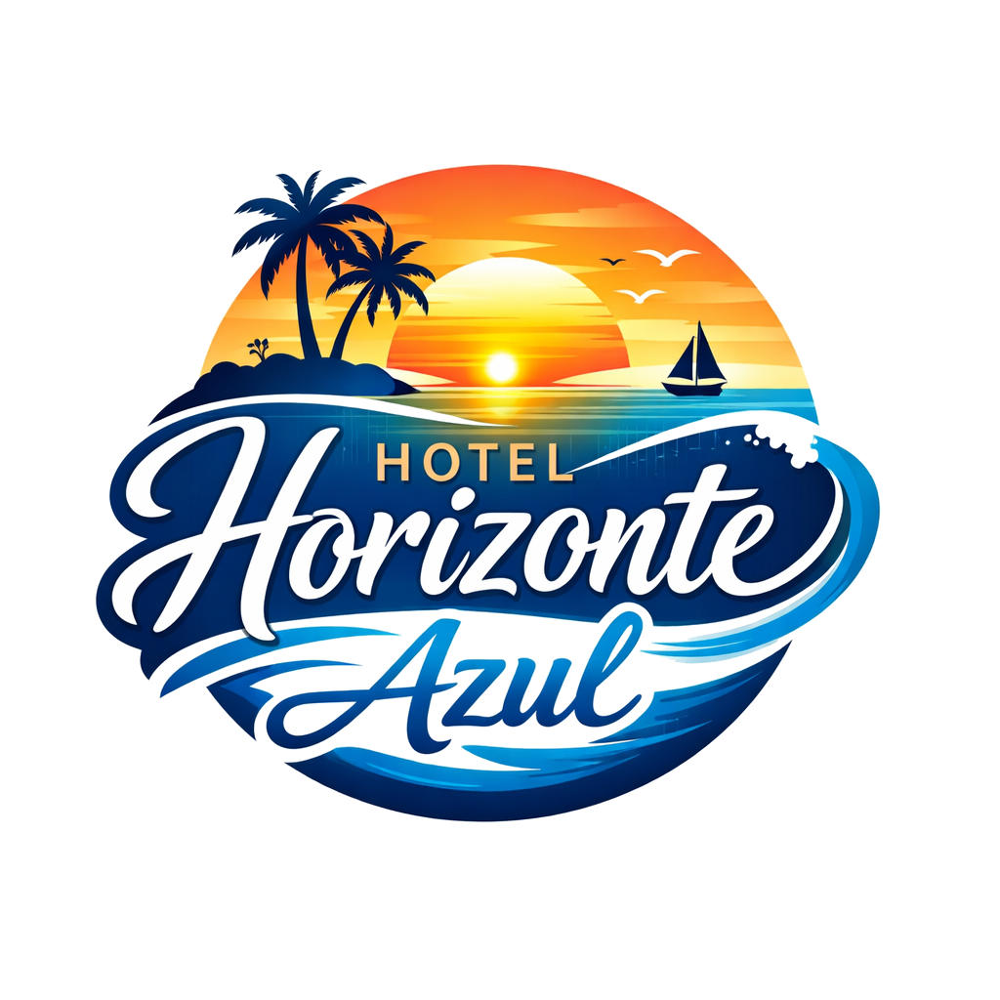

# Código base de "Hotel Horizonte Azul"

Este proyecto es un sistema de reservas de hotel (**NO UN PROGRAMA UTILITARIO**)
para tratar de aprender a usar estas tecnologías:

- Vue 3
- bootstrap
- TypeScript
- Vue-router
- Supabase
- html2pdf.js
- Vite
- vitest

Estas tecnologías están con el propósito de hacer una aplicación full-stack
para la universidad.

### Instalación para desarrollo

Para poder empezar a desarrollar, clona primero el repositorio:
```sh
git clone https://github.com/Lincunia/horizonte_azul
cd horizonte_azul
```
Una vez clonado y accedido, se instalan las siguientes dependencias descritas
en `package.json` de este modo:
```sh
npm ci
```
Esto sólo funciona si se encuentra presente también `package-lock.json`, en caso
de que sólo se encuentre `package.json`, se debe usar:
```sh
npm i
```

### Tests

Usando vitest, se tienen las características configuradas en
[el archivo de configuración](./vitest.config.ts), si la configuración es la
idónea, se debe correr finalmente `npm run test`.

### Logo:

<div align="center">
    
</div>

**Autores:**
 * [Lincunia](https://github.com/Lincunia)
 * [Marcoanpolo](https://github.com/Marcoanpolo)
 * [cnajerat-hash](https://github.com/cnajerat-hash)

